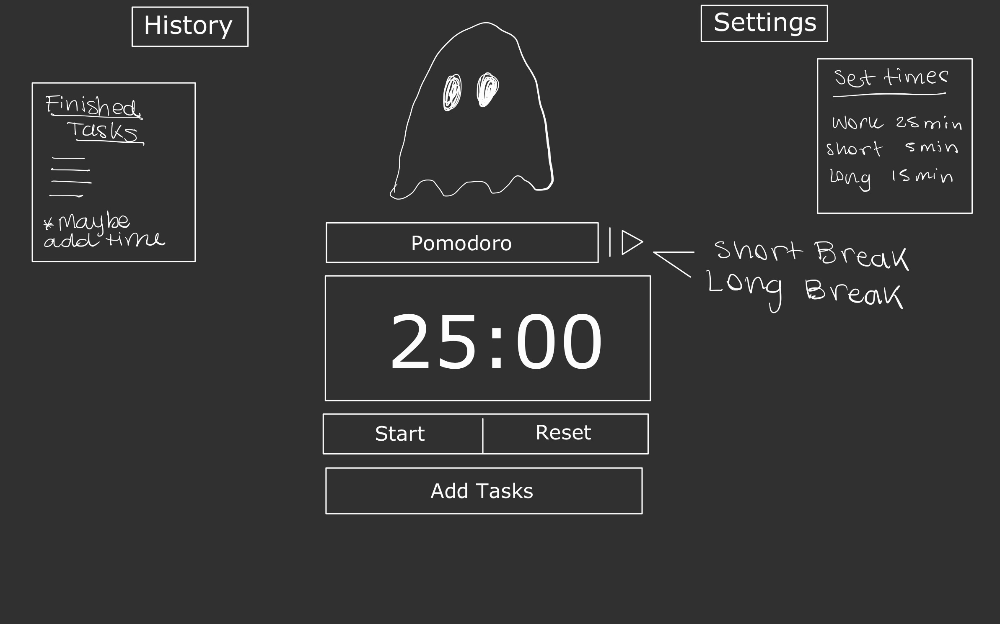

# Ghost Pomodoro 👻

## 🎨 Design

## 🎯 Features

- Pomodoro times
- Add custom times and save time set
- Save history of accomplishments (local db or firebase)
- When user finishes a task - use confetti
- When timer finishes - create a Boo Sound and Ghost moving around the screen to alert users
- Possibility to add music and/or add a playlist from Spotify API
- When user click ghost or when a task is created - make the ghost move and possible motivational quotes from APIs
- Toggle to default pomodoro flow or to user choose manually
- Maybe create inputs for timer flow instead of pomodoro flow

## ⚙️ Installation & Usage

## 💻 Technologies

## 👀 Demo

## ✨ Inspiration

- [Viki-code Ghost](https://codepen.io/viki-code/pen/gOqbjLN)
- [Pomodoro Kitty](https://pomodorokitty.com/)
- [Pomofocus](https://pomofocus.io/)
- [studywithme.io](https://studywithme.io/aesthetic-pomodoro-timer/)

## 📚 Lessons Learned

- How to use, style and add SVG images to components
- How to create and use custom hooks

## ⚖️ License

GNU General Public License v3.0
